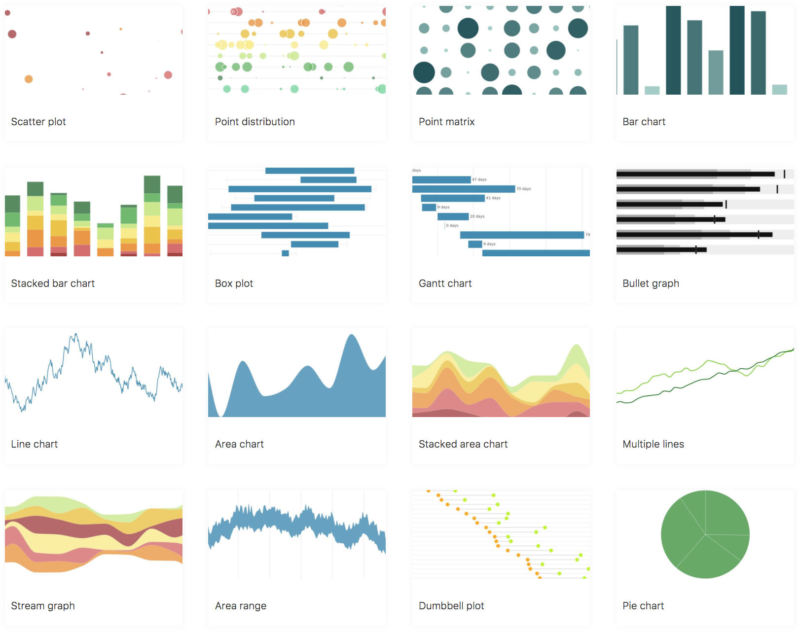

[](https://circleci.com/gh/qlik-oss/picasso.js)
[](https://codeclimate.com/github/qlik-oss/picasso.js/maintainability)
[](https://codeclimate.com/github/qlik-oss/picasso.js/test_coverage)


A charting library streamlined for building interactive visualizations for the Qlik product suites.

[](https://qlik.dev)

## Getting started

### Installing

```sh
npm install picasso.js
```

### Usage

```js
import picasso from 'picasso.js';

picasso.chart({
  element: document.querySelector('#container'), // container must have a width and height specified
  settings: {
    scales: {
      budget: { max: 5000, min: 0 },
      sales: { max: 11000, min: 3000, invert: true },
    },
    components: [
      {
        type: 'axis',
        scale: 'budget',
        layout: {
          dock: 'bottom',
        },
      },
      {
        type: 'axis',
        scale: 'sales',
        layout: {
          dock: 'left',
        },
      },
      {
        type: 'point',
        data: [
          { sales: 7456, margin: 0.3, budget: 4557 },
          { sales: 5603, margin: 0.7, budget: 2234 },
          { sales: 8603, margin: 0.6, budget: 4121 },
          { sales: 4562, margin: 0.4, budget: 1234 },
          { sales: 9873, margin: 0.9, budget: 3453 },
        ],
        settings: {
          x: { scale: 'budget', fn: (d) => d.scale(d.datum.value.budget) },
          y: { scale: 'sales', fn: (d) => d.scale(d.datum.value.sales) },
          size: (d) => d.datum.value.margin,
        },
      },
    ],
  },
});
```

More examples and documentation can be found at [qlik.dev](https://qlik.dev)

## Run examples locally

See and try out picasso features by starting the development studio by running:

`yarn start`

## API

The API can be found at [the Qlik developer portal](https://qlik.dev/apis/javascript/picassojs)

## Packages

| name                    | status                                                       | description                                                                                                                                                                                                             |
| ----------------------- | ------------------------------------------------------------ | ----------------------------------------------------------------------------------------------------------------------------------------------------------------------------------------------------------------------- |
| [picasso.js]            | [![picasso.js-status]][picasso.js-npm]                       | A charting library streamlined for building visualizations for the Qlik Sense Analytics platform.                                                                                                                       |
| [picasso-plugin-hammer] | [![picasso-plugin-hammer-status]][picasso-plugin-hammer-npm] | A plugin that binds events using HammerJS. This plugin provides an API for binding HammerJS recognizers to the chart element in a declarative way.                                                                      |
| [picasso-plugin-q]      | [![picasso-plugin-q-status]][picasso-plugin-q-npm]           | The q plugin registers a q dataset type that makes it a bit easier to extract data from a QIX hypercube. It also contains a brush helper that can be used to find appropriate selections in the underlying data engine. |

## License

`picasso.js` is [MIT licensed](./LICENSE).

[picasso.js]: https://github.com/qlik-oss/picasso.js
[picasso.js-status]: https://img.shields.io/npm/v/picasso.js.svg
[picasso.js-npm]: https://www.npmjs.com/package/picasso.js
[picasso-plugin-hammer]: https://github.com/qlik-oss/picasso.js
[picasso-plugin-hammer-status]: https://img.shields.io/npm/v/picasso-plugin-hammer.svg
[picasso-plugin-hammer-npm]: https://www.npmjs.com/package/picasso-plugin-hammer
[picasso-plugin-q]: https://github.com/qlik-oss/picasso.js
[picasso-plugin-q-status]: https://img.shields.io/npm/v/picasso-plugin-q.svg
[picasso-plugin-q-npm]: https://www.npmjs.com/package/picasso-plugin-q

## Contributing

Please follow the instructions in our [contributing guide](./.github/CONTRIBUTING.md).
