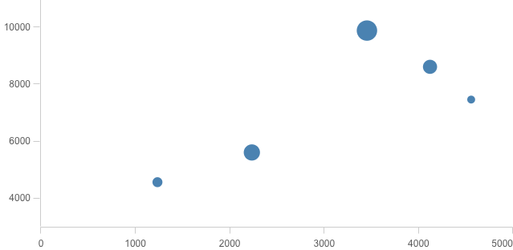

A charting library streamlined for building visualizations for the Qlik Sense Analytics platform.

### Documentation

Visit [picassojs.com](https://picassojs.com) for documentation and examples.

### Installing

```sh
npm install picasso.js
```

### Usage

```js
import picasso from 'picasso.js';

picasso.chart({
  element: document.querySelector('#container'),
  settings: {
    scales: {
      budget: { max: 5000, min: 0 },
      sales: { max: 11000, min: 3000, invert: true },
    },
    components: [
      {
        type: 'axis',
        scale: 'budget',
        layout: {
          dock: 'bottom',
        },
      },
      {
        type: 'axis',
        scale: 'sales',
        layout: {
          dock: 'left',
        },
      },
      {
        type: 'point',
        data: [
          { sales: 7456, margin: 0.3, budget: 4557 },
          { sales: 5603, margin: 0.7, budget: 2234 },
          { sales: 8603, margin: 0.6, budget: 4121 },
          { sales: 4562, margin: 0.4, budget: 1234 },
          { sales: 9873, margin: 0.9, budget: 3453 },
        ],
        settings: {
          x: {
            scale: 'budget',
            fn() {
              return this.scale(this.data.value.budget);
            },
          },
          y: {
            scale: 'sales',
            fn() {
              return this.scale(this.data.value.sales);
            },
          },
          size() {
            return this.data.value.margin;
          },
        },
      },
    ],
  },
});
```



[See more examples](https://picassojs.com/examples)
